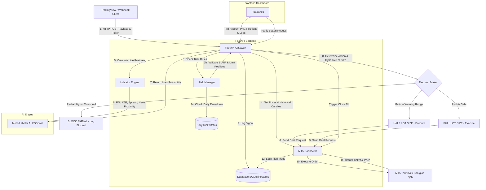

# 🛠️ TÀI LIỆU KIẾN TRÚC HỆ THỐNG BOTXAU (BETA)

Tài liệu này đóng vai trò như một **Snapshot** toàn diện về kiến trúc, cấu trúc thư mục, quy trình hoạt động, và hướng dẫn vận hành/bảo trì hệ thống giao dịch tự động tích hợp AI Bộ lọc lệnh thua (**AI Loss-Filtering / Meta-Labeling**) cho sản phẩm XAU/USD.

---

## 📊 1. SƠ ĐỒ KIẾN TRÚC & LUỒNG TÍN HIỆU (SIGNAL FLOW)

Hệ thống được chia làm 3 khối hoạt động độc lập nhưng liên kết chặt chẽ:



---

## 📁 2. CẤU TRÚC THƯ MỤC CHI TIẾT

```text
BotXau(beta)/
├── backend/                    # CỔNG KẾT NỐI & QUẢN TRỊ RỦI RO (FASTAPI)
│   ├── app/                    # Codebase chính của FastAPI
│   │   ├── __init__.py
│   │   ├── config.py           # Đọc biến môi trường (.env), cấu hình các ngưỡng rủi ro, SL/TP
│   │   ├── database.py         # Khởi tạo SQLAlchemy engine, quản lý session DB
│   │   ├── models.py           # Định nghĩa cấu trúc các bảng (Strategy, TradeSignal, ExecutedTrade, DailyRiskStatus)
│   │   ├── mt5_connector.py    # Cầu kết nối trực tiếp với MT5 Terminal, hỗ trợ Mock Mode chạy đa nền tảng
│   │   ├── risk_manager.py     # Bộ lọc kiểm tra drawdown ngày, giới hạn lệnh và tính Lot size động dựa vào SL
│   │   └── main.py             # Điểm khởi chạy FastAPI, routing API (webhook, dashboard, panic)
│   └── requirements.txt        # Các thư viện Python cần thiết (FastAPI, Scikit-learn, XGBoost, MT5)
│
├── ai_engine/                  # BACKTEST ENGINE & HUẤN LUYỆN MACHINE LEARNING
│   ├── data/
│   │   └── backtest_trades.csv # Dataset lịch sử thu được từ Backtest làm dữ liệu huấn luyện AI
│   ├── models/
│   │   └── meta_labeler_model.joblib # File lưu trữ mô hình XGBoost đã được huấn luyện thành công
│   ├── news_fetcher.py         # Thu thập và mô phỏng lịch tin tức kinh tế USD (CPI, NFP, FOMC)
│   ├── backtest.py             # Giả lập chạy lại chiến lược trong quá khứ để thu thập đặc trưng và gắn nhãn lệnh thua (1)
│   └── meta_labeler.py         # Tiền xử lý, huấn luyện mô hình XGBoost, và suy luận xác suất thua realtime
│
├── frontend/                   # GIAO DIỆN GIÁM SÁT REAL-TIME (REACT + VITE + TAILWIND)
│   ├── src/
│   │   ├── App.jsx             # Giao diện chính Dashboard (PnL, Active positions, AI Block logs, Panic Button)
│   │   ├── index.css           # Cấu hình Tailwind, Google Fonts, Glassmorphism CSS
│   │   └── main.jsx            # React Bootstrap
│   ├── index.html              # HTML entrypoint
│   ├── postcss.config.js       # Cấu hình PostCSS
│   ├── tailwind.config.js      # Cấu hình Tailwind theme (màu Gold, Dark)
│   ├── vite.config.js          # Cấu hình Vite dev server (cổng 5173)
│   └── package.json            # Các thư viện Frontend (Lightweight-charts, Lucide-react, React)
│
├── system_snapshot.md          # Tệp tin Snapshot kiến trúc hệ thống hiện tại (Tệp này)
└── .gitignore                  # Bỏ qua các tệp cache, DB cục bộ, mô hình đã lưu
```

---

## ⚡ 3. HƯỚNG DẪN CÀI ĐẶT & KHỞI CHẠY HỆ THỐNG

### Bước 1: Thiết lập Backend & Huấn luyện AI
1. Mở PowerShell trong thư mục `backend/`
2. Cài đặt các thư viện cần thiết:
   ```bash
   pip install -r requirements.txt
   ```
3. Tạo file `backend/.env` nếu cần tinh chỉnh (nếu chạy thật trên Windows):
   ```ini
   MT5_MOCK=False
   MT5_LOGIN=50123456
   MT5_PASSWORD=YourStrongPassword
   MT5_SERVER=ICMarkets-Demo
   ```
4. Khởi chạy Backend FastAPI:
   ```bash
   python -m backend.main
   ```
   *(Hệ thống sẽ tự động phát hiện nếu chưa có mô hình AI, nó sẽ chạy Backtest giả lập 120 ngày để tự động huấn luyện mô hình XGBoost `meta_labeler_model.joblib` ngay trong lần khởi chạy đầu tiên)*

### Bước 2: Thiết lập Frontend Dashboard
1. Di chuyển vào thư mục `frontend/`
2. Cài đặt các gói thư viện Node.js:
   ```bash
   npm install
   ```
3. Khởi chạy Development Server:
   ```bash
   npm run dev
   ```
4. Mở trình duyệt truy cập: `http://localhost:5173`

---

## 🧠 4. CƠ CHẾ HOẠT ĐỘNG CỦA BỘ LỌC AI (META-LABELING)

1. **Gán nhãn (Labeling):** Khi chạy Backtest, bất kỳ lệnh nào chạm Stop Loss trước sẽ được gán nhãn là `1` (Thua), ngược lại chạm Take Profit trước gán nhãn `0` (Thắng).
2. **Các đặc trưng môi trường huấn luyện (Features):**
   * `rsi`: Chỉ báo sức mạnh tương đối tại thời điểm vào lệnh.
   * `atr`: Độ biến động trung bình thực tế tại thời điểm vào lệnh.
   * `dist_ema200`: Khoảng cách từ giá hiện tại đến đường xu hướng EMA200.
   * `spread`: Độ giãn spread tại thời điểm vào lệnh.
   * `hour` & `day_of_week`: Khung thời gian và ngày trong tuần.
   * `mins_to_news`: Khoảng cách thời gian (bằng phút) tới tin đỏ kinh tế Mỹ (CPI, NFP, FOMC).
   * `action_code`: Chiều đi lệnh (0: BUY, 1: SELL).
3. **Quyết định Real-time:**
   Khi nhận tín hiệu webhook mới $\rightarrow$ Hệ thống lấy nến lịch sử từ MT5 $\rightarrow$ Tính toán chỉ báo và khoảng cách tin $\rightarrow$ Gọi AI dự đoán:
   * **Nếu Xác suất thua >= 60%:** AI chặn lệnh, không gửi lên sàn. Status: `BLOCKED_BY_AI`.
   * **Nếu Xác suất thua >= 45% và < 60%:** Lệnh được đi nhưng giảm 1/2 Lot size để kiểm soát rủi ro. Status: `HALF_SIZE`.
   * **Nếu Xác suất thua < 45%:** Lệnh được đi full Lot size theo cấu hình quản trị rủi ro. Status: `ALLOWED`.

---

## 🛡️ 5. LUẬT QUẢN TRỊ RỦI RO (RISK CONTROL)

Hệ thống tích hợp 3 bộ khóa bảo vệ tài khoản:
1. **Enforce Stop Loss:** Bắt buộc mọi tín hiệu vào lệnh Buy/Sell phải có giá trị Stop Loss, nếu không hệ thống sẽ từ chối để tránh rủi ro không giới hạn.
2. **Dynamic Position Sizing:** Tự động tính toán số Lot dựa trên khoảng cách SL để nếu chạm SL chỉ thua tối đa $1\%$ số dư tài khoản (`settings.RISK_MAX_TRADE_RISK_PCT`).
3. **Daily Drawdown Cap:** Nếu trong ngày, Equity sụt giảm quá $5\%$ (`settings.RISK_MAX_DAILY_DRAWDOWN_PCT`) tính từ đỉnh Equity cao nhất trong ngày:
   * Tài khoản chuyển sang trạng thái `Blocked`.
   * Tự động đóng toàn bộ các lệnh đang mở (Panic Button).
   * Từ chối mở thêm bất kỳ lệnh mới nào cho đến khi qua ngày hôm sau.

---

## 🚨 6. QUY TRÌNH XỬ LÝ KHẨN CẤP & BẢO TRÌ

*   **Kích hoạt Panic Button:** 
    *   Nhấp vào nút **PANIC BUTTON** đỏ trên Dashboard. Hệ thống sẽ gọi API `/api/panic` đóng lập tức tất cả các vị thế mở trên MT5 và cập nhật trạng thái trong cơ sở dữ liệu.
*   **Huấn luyện lại AI (Retraining):**
    *   Sau một thời gian giao dịch (ví dụ: sau mỗi tháng), market có thể thay đổi cấu trúc. Người dùng chỉ cần nhấp nút **CHẠY BACKTEST & HUẤN LUYỆN LẠI AI** trên Dashboard. Hệ thống sẽ chạy lại backtest trên dữ liệu mới nhất, tạo bộ đặc trưng mới và ghi đè file mô hình `meta_labeler_model.joblib`.
*   **Bật/Tắt AI Filter:**
    *   Nếu muốn tắt lớp AI để chạy thuần chiến lược gốc, người dùng chỉ cần tắt nút gạt **AI Loss-Filtering** trên Dashboard. Hệ thống sẽ bỏ qua bước dự đoán AI và cho phép lệnh đi trực tiếp sang MT5 (nhưng vẫn kiểm tra qua Risk Manager).

---

## ⏱️ 7. ĐỊNH DẠNG MÚI GIỜ VIỆT NAM (GMT+7)

Toàn bộ thời gian hiển thị lịch sử tín hiệu và nhật ký giao dịch trên Dashboard được tự động định dạng và đồng bộ theo múi giờ Việt Nam (**GMT+7, Asia/Ho_Chi_Minh**) thông qua hàm tiện ích `formatVietnamTime` ở phía React Frontend. 
Định dạng hiển thị: `DD/MM/YYYY, HH:mm:ss` (Ví dụ: `10/06/2026, 21:30:15`) giúp người dùng dễ dàng đối chiếu chuẩn xác với đồ thị thực tế trên terminal MetaTrader 5.
